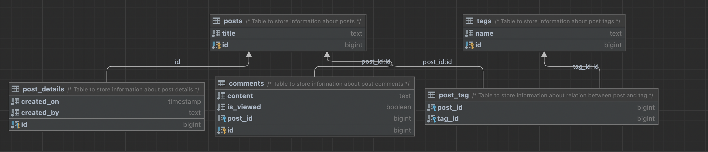

<h1 align="center"> ms.payment.collector </h1> <br>

## Table of Contents

- [Introduction](#Introduction)
- [How to run locally](#How-to-run-locally)
- [Dependencies](#Dependencies-from-microservices)
- [Tech stack](#Tech-stack)
- [Swagger](#Swagger-link)
- [DB ERD](#Microservice-database-ERD)

## Introduction

This adapter is responsible to send sms to Bimtek service. It listens to bimtek sms queue and stores history of request in database.

## How to run locally

```shell script
$ java -jar ms.payment.collector.jar --spring.profiles.active=dev
```

## Dependencies from microservices

1. [ms.payment.transit.core-file-reader](https://github.com/ilkin-aliyev/spock-example)

## Tech stack
1. RabbitMQ
2. Redis
3. PostgreSQL
4. Spring Boot
5. Java 11

## Swagger link
[Link](http://localhost:8080/swagger-ui.html#/)

## Microservice database ERD


